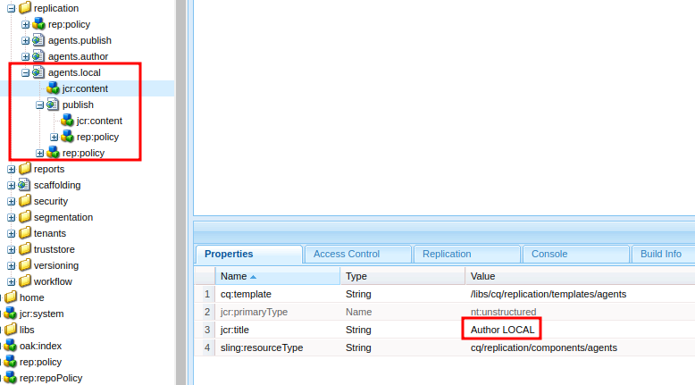
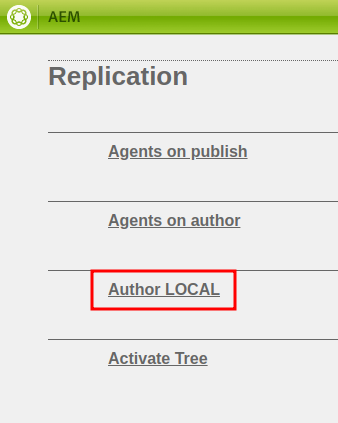
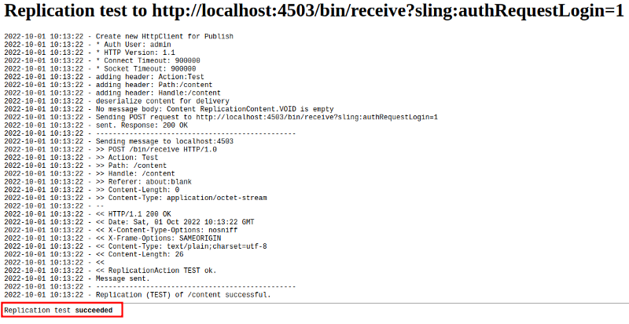
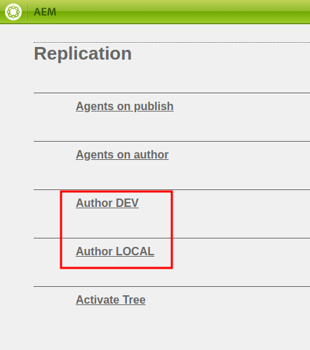
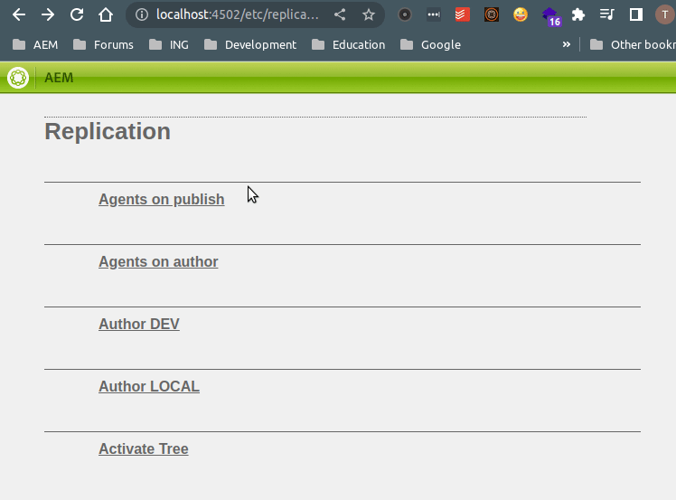

# AEM: Deploying replication agents as code
Include your replication agents in your git repository

## Use case

Let's imagine you want to install AEM with a pretty standard, simple topology. You may have 4 environments (local, dev, uat, prod) and each environments consists of one author replicating to two publishers. 

That means you have 8 replication agents to set up, 12 if you add a dispatcher, 20 if you want reverse-replication, etc.

Configuring these replication agents can start to become a bit of a chore, especially if you are using custom replication and transport (receiver) users. You should btw, it's [in the security checklist](https://experienceleague.adobe.com/docs/experience-manager-64/administering/security/security-checklist.html?lang=en#configure-replication-and-transport-users).

I've often seen AEM customers configure the replication agents manually as if it's some sort of AEM right-of-passage. But actually, you can add the replication agents into your git repository and then deploy them like anything else. 

So let's give it a go 😀

## Using a run mode

The first thing is to make sure that your AEM instances are running with run modes that allows us to distinguish by environment. If you don't know what a run mode is, please read [this official documentation](https://experienceleague.adobe.com/docs/experience-manager-65/deploying/configuring/configure-runmodes.html?lang=en).

For example:

* Your local Author might run with `author,local`
* Your DEV Author might run with `author,dev`

We will attach our replication agents to these environment run modes, so make sure you have them active.

## Creating a local agent

Now let's create the agents. 

Let's start with the local environment. Here we'll create just one agent, which replicates from your local `author` instance to your local `publish` instance.

The easiest way to go about this is probably to start by copying the `/etc/replication/agents.author` node to `/etc/replication/agents.local`, then delete the agents you're not interested in. In this case, we'll remove everything except `publish`:



As you can see in the screenshot, I also renamed the `agents.local` `jcr:title`.

Now, if you navigate to `/etc/replication`, you will see a new addition to the list!



This interface is quite handy for configuring the agent, so you can do so now. In my case I'm going to start off basic, using the `admin` user everywhere (yes, it's naughty, I know, we'll fix it later). 

Make sure to test your agent (http://localhost:4502/etc/replication/agents.local/publish.test.html) once you've configured it to guarantee that it all works as expected:



If you pull the `/etc/replication/agents.local` node into your repo, you should have an XML file that represents the replication agent:

```xml
<?xml version="1.0" encoding="UTF-8"?>
<jcr:root xmlns:sling="http://sling.apache.org/jcr/sling/1.0" xmlns:cq="http://www.day.com/jcr/cq/1.0" xmlns:jcr="http://www.jcp.org/jcr/1.0" xmlns:nt="http://www.jcp.org/jcr/nt/1.0" xmlns:rep="internal"
    jcr:mixinTypes="[rep:AccessControllable]"
    jcr:primaryType="cq:Page">
    <jcr:content
        cq:template="/libs/cq/replication/templates/agent"
        jcr:description="Agent that replicates to the default publish instance."
        jcr:primaryType="nt:unstructured"
        jcr:title="Publish"
        sling:resourceType="cq/replication/components/agent"
        enabled="true"
        logLevel="info"
        retryDelay="60000"
        serializationType="durbo"
        ssl="default"
        transportPassword="\{ba9f6a513c4aba03b33bd50d23a2032e6326c84d8a1d72fadfad8ee4301a2e5a}"
        transportUri="http://localhost:4503/bin/receive?sling:authRequestLogin=1"
        transportUser="admin"
        userId="admin"/>
</jcr:root>
```

Great! 🙂 With this, your fellow developers can deploy the replication agent to their local instances! 

> ### Creating a new module
> I've opted to create a new module called `ui.replication` to host the replication agents.
> 
> I'll let you decide if you want to do the same. If you just want to get to the end of this tutorial to prove a concept, then you can skip this step.
> 
> I will not explain how this is done as it's simple Maven stuff, but scroll to the end of this article for a Github link if you want to see what it looks like.

## Creating agents for other environments

Imagine you now want the same `publish` replication agent on other environments. For example, you'd like to be able to publish pages from from your DEV Author instance to your DEV Publish instance. 

Simply copy `/etc/replication/agents.local` to `/etc/replication/agents.dev` and replace:

* The `jcr:title` property of `/etc/replication/agents.dev/.content.xml`
* The `transportUri` and `transportPassword` of `/etc/replication/agents.dev/publish/.content.xml`

Here is an example:

```xml
<?xml version="1.0" encoding="UTF-8"?>
<jcr:root xmlns:sling="http://sling.apache.org/jcr/sling/1.0" xmlns:cq="http://www.day.com/jcr/cq/1.0" xmlns:jcr="http://www.jcp.org/jcr/1.0" xmlns:nt="http://www.jcp.org/jcr/nt/1.0" xmlns:rep="internal"
    jcr:mixinTypes="[rep:AccessControllable]"
    jcr:primaryType="cq:Page">
    <jcr:content
        cq:template="/libs/cq/replication/templates/agent"
        jcr:description="Agent that replicates to the default publish instance."
        jcr:primaryType="nt:unstructured"
        jcr:title="Publish"
        sling:resourceType="cq/replication/components/agent"
        enabled="true"
        logLevel="info"
        retryDelay="60000"
        serializationType="durbo"
        ssl="default"
        transportPassword="\{8621078f9b44db113fd091bc3e1bbbf39f2775907f227d726f1bd301f2198be9}"
        transportUri="http://dev.publish:4503/bin/receive?sling:authRequestLogin=1"
        transportUser="admin"
        userId="admin"/>
</jcr:root>
```

Deploy to your local instance again and go to `/etc/replication`. You should now see the LOCAL and DEV agents:



This is normal. All agents will be deployed, but only the agents that match your run modes will be active. For example, here is my local Author:



The principle is the same for UAT, PROD or any environment you like. Just make sure that those instances also have matching run modes.

## ⚠️ Combining run modes

Of course, we only want our replication agent to be active on the `author` instance. Therefore we would need to distinguish which agent is active on the `author` and which is on the `publish`. This is possible, but a bit tricky.

Typically in AEM, you can combine run modes with an AND logical operator. For example for configurations:

* `/apps/demo/osgiconfig/config.author` applies to all `author` instances
* `/apps/demo/osgiconfig/config.dev` applies to all `dev` instances
* `/apps/demo/osgiconfig/config.author.dev` applies to an instance if it has __both__ the `author` and the `dev` run mode

However, replication agents combine run modes with an OR logical operator (don't ask me why). For example:

* `/etc/replication/agents.author` applies to all `author` instances
* `/etc/replication/agents.dev` applies to all `dev` instances
* `/etc/replication/agents.author.dev` applies to an instance if it has __either__ the `author` or the `dev` run mode

Unfortunately, this leaves you with these two options:

1. If you only want replication agents on `author`, then deploy the replication agents only to `author`. This is the approach I use for this tutorial, by not including the `ui.replication` module in the `all` package (see Github link at the bottom of the article).
2. If you want some agents on `author` and other on `publish`, then you must create a separate run modes, (eg: `author-dev`, `publish-dev`) and use those in your replication agents (eg: `/etc/replication/agents.author-dev`).

## Using replication users

At this point you should have working, environment-specific replication agents. 

The problem now is that we are using full `admin` privileges for replication, which can lead to security vulnerabilities. As mentioned before, Adobe considers this important enough to publish in the [security checklist]((https://experienceleague.adobe.com/docs/experience-manager-64/administering/security/security-checklist.html?lang=en#configure-replication-and-transport-users)).

To paraphrase Adobe's explanation, there are two users that work to replication content:
1. The replication user, which reads content from the source instance (eg: `author`). 
2. The transport user that writes content to the target instance (eg: `publish`)

Both users should have permissions only on the content that is eligible for replication.

I'll let you decide what those permissions will be for your application. But for the purpose of this article, let's imagine you have two users:

* `replication-user` on the `author` instance
* `transport-user` on the `publish` instance

## Password encryption

The `replication-user` is the easiest to use. You can do so by setting the following property in your replication agent XML file: 

```xml
userId="replication-user"
```

For the `transport-user`, its a bit more complicated. Since the `author` instance will have to authenticate on the `publish` instance, we need to provide the password in the XML file. 

In order to avoid exposing the password when it is pushed to your code repository, it must first be encrypted. 

To do this, go to `/system/console/crypto` on your `author` instance and encrypt the password for `transport-user`, or use the following curl command:

```bash
curl -u admin:admin -F"datum=password-goes-here" http://localhost:4502/system/console/crypto/.json
```

Take resulting encrypted value (curly braces included) and set the `transportPassword`  property, like so:
```xml
transportPassword="{String}{537dc0a2c2de05f46fa9d65fb884c5b243fb2948e2f4b0ab4826c0912dc2154e}"
```

The `{String}` prefix tells AEM to consider the decrypted value as a string.

The end result looks like this:

`/etc/replication/agents.local`
```xml
<?xml version="1.0" encoding="UTF-8"?>
<jcr:root xmlns:sling="http://sling.apache.org/jcr/sling/1.0" xmlns:cq="http://www.day.com/jcr/cq/1.0" xmlns:jcr="http://www.jcp.org/jcr/1.0" xmlns:nt="http://www.jcp.org/jcr/nt/1.0" xmlns:rep="internal"
    jcr:mixinTypes="[rep:AccessControllable]"
    jcr:primaryType="cq:Page">
    <jcr:content
        cq:template="/libs/cq/replication/templates/agent"
        jcr:description="Agent that replicates to the default publish instance."
        jcr:primaryType="nt:unstructured"
        jcr:title="Publish"
        sling:resourceType="cq/replication/components/agent"
        enabled="true"
        logLevel="info"
        retryDelay="60000"
        serializationType="durbo"
        ssl="default"
        transportPassword="{String}{537dc0a2c2de05f46fa9d65fb884c5b243fb2948e2f4b0ab4826c0912dc2154e}"
        transportUri="http://localhost:4503/bin/receive?sling:authRequestLogin=1"
        transportUser="transport-user"
        userId="replication-user"/>
</jcr:root>
```

`/etc/replication/agents.dev`
```xml
<?xml version="1.0" encoding="UTF-8"?>
<jcr:root xmlns:sling="http://sling.apache.org/jcr/sling/1.0" xmlns:cq="http://www.day.com/jcr/cq/1.0" xmlns:jcr="http://www.jcp.org/jcr/1.0" xmlns:nt="http://www.jcp.org/jcr/nt/1.0" xmlns:rep="internal"
    jcr:mixinTypes="[rep:AccessControllable]"
    jcr:primaryType="cq:Page">
    <jcr:content
        cq:template="/libs/cq/replication/templates/agent"
        jcr:description="Agent that replicates to the default publish instance."
        jcr:primaryType="nt:unstructured"
        jcr:title="Publish"
        sling:resourceType="cq/replication/components/agent"
        enabled="true"
        logLevel="info"
        retryDelay="60000"
        serializationType="durbo"
        ssl="default"
        transportPassword="{String}{9ceef3f083eb276082f17a81dcaf9b241ec79767df44ebf8d32a3d894c333652}"
        transportUri="http://dev.publish:4503/bin/receive?sling:authRequestLogin=1"
        transportUser="transport-user"
        userId="replication-user"/>
</jcr:root>
```